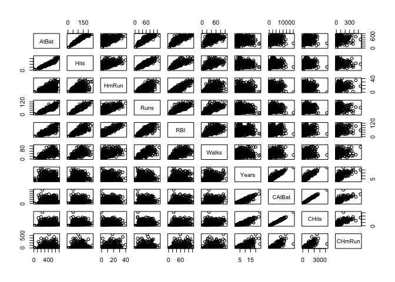

Decision Tree Example
================
Lydia Hsu

Load the dataset.

``` r
library(ISLR)
data("Hitters")
summary(Hitters)
```

    ##      AtBat            Hits         HmRun            Runs       
    ##  Min.   : 16.0   Min.   :  1   Min.   : 0.00   Min.   :  0.00  
    ##  1st Qu.:255.2   1st Qu.: 64   1st Qu.: 4.00   1st Qu.: 30.25  
    ##  Median :379.5   Median : 96   Median : 8.00   Median : 48.00  
    ##  Mean   :380.9   Mean   :101   Mean   :10.77   Mean   : 50.91  
    ##  3rd Qu.:512.0   3rd Qu.:137   3rd Qu.:16.00   3rd Qu.: 69.00  
    ##  Max.   :687.0   Max.   :238   Max.   :40.00   Max.   :130.00  
    ##                                                                
    ##       RBI             Walks            Years            CAtBat       
    ##  Min.   :  0.00   Min.   :  0.00   Min.   : 1.000   Min.   :   19.0  
    ##  1st Qu.: 28.00   1st Qu.: 22.00   1st Qu.: 4.000   1st Qu.:  816.8  
    ##  Median : 44.00   Median : 35.00   Median : 6.000   Median : 1928.0  
    ##  Mean   : 48.03   Mean   : 38.74   Mean   : 7.444   Mean   : 2648.7  
    ##  3rd Qu.: 64.75   3rd Qu.: 53.00   3rd Qu.:11.000   3rd Qu.: 3924.2  
    ##  Max.   :121.00   Max.   :105.00   Max.   :24.000   Max.   :14053.0  
    ##                                                                      
    ##      CHits            CHmRun           CRuns             CRBI        
    ##  Min.   :   4.0   Min.   :  0.00   Min.   :   1.0   Min.   :   0.00  
    ##  1st Qu.: 209.0   1st Qu.: 14.00   1st Qu.: 100.2   1st Qu.:  88.75  
    ##  Median : 508.0   Median : 37.50   Median : 247.0   Median : 220.50  
    ##  Mean   : 717.6   Mean   : 69.49   Mean   : 358.8   Mean   : 330.12  
    ##  3rd Qu.:1059.2   3rd Qu.: 90.00   3rd Qu.: 526.2   3rd Qu.: 426.25  
    ##  Max.   :4256.0   Max.   :548.00   Max.   :2165.0   Max.   :1659.00  
    ##                                                                      
    ##      CWalks        League  Division    PutOuts          Assists     
    ##  Min.   :   0.00   A:175   E:157    Min.   :   0.0   Min.   :  0.0  
    ##  1st Qu.:  67.25   N:147   W:165    1st Qu.: 109.2   1st Qu.:  7.0  
    ##  Median : 170.50                    Median : 212.0   Median : 39.5  
    ##  Mean   : 260.24                    Mean   : 288.9   Mean   :106.9  
    ##  3rd Qu.: 339.25                    3rd Qu.: 325.0   3rd Qu.:166.0  
    ##  Max.   :1566.00                    Max.   :1378.0   Max.   :492.0  
    ##                                                                     
    ##      Errors          Salary       NewLeague
    ##  Min.   : 0.00   Min.   :  67.5   A:176    
    ##  1st Qu.: 3.00   1st Qu.: 190.0   N:146    
    ##  Median : 6.00   Median : 425.0            
    ##  Mean   : 8.04   Mean   : 535.9            
    ##  3rd Qu.:11.00   3rd Qu.: 750.0            
    ##  Max.   :32.00   Max.   :2460.0            
    ##                  NA's   :59

Exploratory data analysis.

``` r
sum(is.na(Hitters))
```

    ## [1] 59

``` r
hitters = Hitters[!is.na(Hitters),]
hist(Hitters$AtBat)
```

<!-- -->

``` r
hist(Hitters$Hits)
```

<!-- -->

``` r
pairs(Hitters[,1:10])
```

<!-- --> Random forest
model.

``` r
library(tree)
hitters_tree = tree(Salary ~., data = Hitters)
hitters_tree
```

    ## node), split, n, deviance, yval
    ##       * denotes terminal node
    ## 
    ##  1) root 263 53320000  535.9  
    ##    2) CHits < 450 117  5931000  227.9  
    ##      4) AtBat < 147 5  2940000  709.5 *
    ##      5) AtBat > 147 112  1779000  206.4  
    ##       10) CRBI < 114.5 74   302100  141.8 *
    ##       11) CRBI > 114.5 38   567200  332.1 *
    ##    3) CHits > 450 146 27390000  782.8  
    ##      6) Walks < 61 104  9470000  649.6  
    ##       12) AtBat < 395.5 53  2859000  510.0 *
    ##       13) AtBat > 395.5 51  4504000  794.7  
    ##         26) PutOuts < 771 45  2358000  746.4 *
    ##         27) PutOuts > 771 6  1255000 1157.0 *
    ##      7) Walks > 61 42 11500000 1113.0  
    ##       14) RBI < 73.5 22  3148000  885.3  
    ##         28) PutOuts < 239.5 7  1739000 1156.0 *
    ##         29) PutOuts > 239.5 15   656300  758.9 *
    ##       15) RBI > 73.5 20  5967000 1363.0  
    ##         30) Years < 13.5 14  3767000 1521.0  
    ##           60) CAtBat < 3814.5 8   529600 1141.0 *
    ##           61) CAtBat > 3814.5 6   541500 2028.0 *
    ##         31) Years > 13.5 6  1026000  992.5 *

``` r
summary(hitters_tree)
```

    ## 
    ## Regression tree:
    ## tree(formula = Salary ~ ., data = Hitters)
    ## Variables actually used in tree construction:
    ## [1] "CHits"   "AtBat"   "CRBI"    "Walks"   "PutOuts" "RBI"     "Years"  
    ## [8] "CAtBat" 
    ## Number of terminal nodes:  11 
    ## Residual mean deviance:  58630 = 14770000 / 252 
    ## Distribution of residuals:
    ##    Min. 1st Qu.  Median    Mean 3rd Qu.    Max. 
    ## -668.60  -92.31  -10.02    0.00   92.86 1418.00

``` r
plot(hitters_tree )
text(hitters_tree ,pretty =0)
```

<!-- -->

``` r
hitters_prune=prune.tree(hitters_tree)
plot(hitters_prune )
```

<!-- --> ramdom forest

``` r
library(randomForest)
```

    ## randomForest 4.6-14

    ## Type rfNews() to see new features/changes/bug fixes.

``` r
hitters_rf = randomForest(Salary ~., data = na.omit(Hitters))
hitters_rf
```

    ## 
    ## Call:
    ##  randomForest(formula = Salary ~ ., data = na.omit(Hitters)) 
    ##                Type of random forest: regression
    ##                      Number of trees: 500
    ## No. of variables tried at each split: 6
    ## 
    ##           Mean of squared residuals: 77812.51
    ##                     % Var explained: 61.62

``` r
importance(hitters_rf)
```

    ##           IncNodePurity
    ## AtBat        2510782.65
    ## Hits         3064227.44
    ## HmRun        1347865.51
    ## Runs         2850022.25
    ## RBI          3962183.58
    ## Walks        3489639.42
    ## Years        1402561.48
    ## CAtBat       4950284.77
    ## CHits        6693542.14
    ## CHmRun       3088131.49
    ## CRuns        5179535.84
    ## CRBI         5814700.39
    ## CWalks       3710718.02
    ## League         93224.23
    ## Division      143975.39
    ## PutOuts      2060842.34
    ## Assists       641065.65
    ## Errors        754266.26
    ## NewLeague     123392.83

``` r
varImpPlot(hitters_rf)
```

<!-- -->
